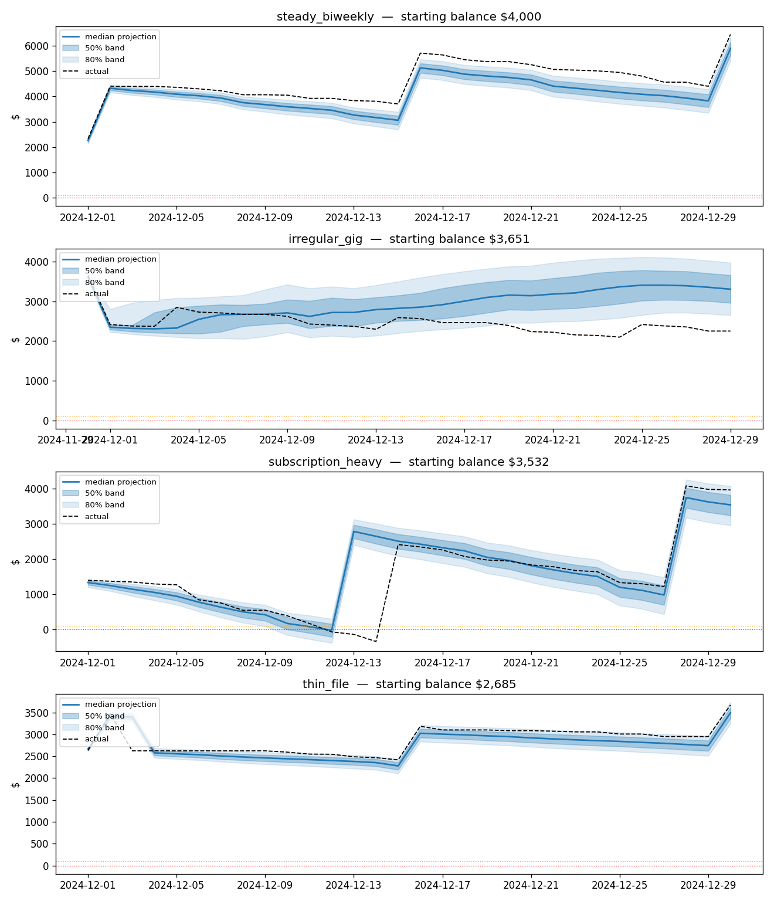
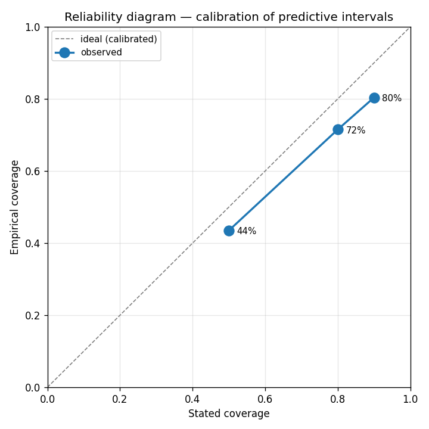

# cashflow-prototype

Notebook-provable cash-flow prediction engine for the "Can I Afford It?" project. The goal is to prove the engine is accurate and **well-calibrated** before any UI is built — see `../PREDICTION_MODEL_DESIGN.md` for the full design.

## Status

| Component | Milestone | State |
|-----------|-----------|-------|
| `synth/generator.py` | M1 | **implemented** — synthetic households with ground-truth labels |
| `notebooks/01_explore_synthetic_data.py` | M1 | **runnable** — EDA + sanity checks |
| `cashflow/recurring.py` | M2 | **implemented** — Stage 1 recurring & bill detection |
| `cashflow/income.py` | M2 | **implemented** — Stage 2 income timing (regular + irregular) |
| `eval/backtest.py` (`score_detection`) | M2 | **implemented** — precision / recall / cadence vs ground truth |
| `notebooks/02_recurring_detection.py` | M2 | **runnable** — full scoring on all four profiles |
| `cashflow/discretionary.py` | M3 | **implemented** — Stage 3 DOW-aware Poisson + Normal-clipped sampler |
| `eval/backtest.py` (`score_discretionary`) | M3 | **implemented** — MAE vs naive + interval coverage |
| `notebooks/03_discretionary_model.py` | M3 | **runnable** — backtest on all four profiles |
| `cashflow/projection.py` | M4 | **implemented** — Monte Carlo projection + `can_i_afford()` query |
| `notebooks/04_projection.py` | M4 | **runnable** — projection vs actual + affordability questions |
| `eval/backtest.py` (calibration / decision) | M5 | **implemented** — pooled calibration + decision confusion matrix |
| `notebooks/05_calibration.py` | M5 | **runnable** — 80-household backtest, reliability curve, FAR |
| `data/plaid_loader.py` + `data/normalize.py` | M6 | **implemented** — Plaid sandbox loader + schema adapter + balance reconstruction |
| `eval/backtest.py` (`run_real_data_backtest`) | M6 | **implemented** — calibration + decision backtest on real-API data |
| `notebooks/06_plaid_calibration.py` | M6 | **runnable** — same M5 eval on Plaid-sourced data (needs PLAID_* keys in .env) |

### M2 results (synthetic backtest, seed=0, 365-day window)

| profile | precision | recall | cadence | schedules |
|---|---|---|---|---|
| steady_biweekly | 100% | 100% | 100% | 9 |
| irregular_gig | 100% | 100% | 100% | 5 |
| subscription_heavy | 100% | 100% | 100% | 15 |
| thin_file | 100% | 100% | 100% | 3 |

Irregular-income behavior verified: Stage 1 correctly rejects the gig
income stream as non-regular; Stage 2 picks it up and forecasts irregular
events with wider date uncertainty (±3 days vs ±1 day for biweekly).

### M3 results (60-day holdout, seed=0)

| profile | mean $/day | DOW MAE | naive MAE | Δ vs naive | 50% cov | 80% cov |
|---|---|---|---|---|---|---|
| steady_biweekly | $72.0 | $50.6 | $50.5 | -0.0% | 47% | 95% |
| irregular_gig | $46.6 | $34.3 | $35.2 | +2.7% | 63% | 95% |
| subscription_heavy | $90.1 | $64.2 | $65.4 | +1.8% | 50% | 88% |
| thin_file | $21.4 | $22.5 | $21.2 | -5.7% | 70% | 87% |

Honest reads:

- DOW model is a modest improvement on data-rich profiles and an even
  draw on sparse ones. With only ~45 obs per DOW in a 305-day history,
  sampling noise consumes most of the ~1.5x weekend signal in the data
  generator. Real consumer history (multi-year, stronger weekend lift)
  should show larger gains.
- Predictive intervals run slightly wide (80% interval covers 88–95%
  vs. nominal 80%). For a conservative cashflow oracle this is the
  *safer* failure mode — over-confident intervals would have been the
  dangerous one.
- The `sample_daily_spend(model, day, rng)` interface is in place and
  ready for M4 Monte Carlo to call thousands of times per trajectory.

### M4 results (5,000 sims × 30-day horizon, seed=0)



The Monte Carlo projection runs end-to-end and `can_i_afford()` produces
verdicts that track each profile's structure:

| profile | $200 | $800 | $1,500 | $2,500 |
|---|---|---|---|---|
| steady_biweekly | affordable (0%) | affordable (0%) | affordable (0%) | not affordable (100%) |
| irregular_gig | affordable (0%) | affordable (0%) | affordable (0%) | not affordable (~80%) |
| subscription_heavy | not affordable (81%) | not affordable (73%) | not affordable (100%) | not affordable (100%) |
| thin_file | affordable (0%) | affordable (0%) | affordable (0%) | not affordable (57–100%) |

Subscription-heavy is correctly flagged not-affordable even at $100,
because the projection sees mid-month electric/insurance bills breach
the $100 safety buffer regardless of additional spend — the household
is structurally on the edge. Drivers map correctly: rent on day 1,
ConEd electric mid-month, etc.

Single-trajectory band coverage (one realization of one synthetic
household) is NOT a calibration verdict — that's an M5 deliverable
across many seeds. The projection mechanics, query, and driver
attribution are all working as designed.

### M5 results (4 profiles × 20 seeds = 80 households, 2,400 point-days, 800 decisions)



**The headline number — false-affordable rate is 0.6%.** Out of 800
random affordability questions across 80 synthetic households, the
engine said "yes you can afford it" only 5 times when reality actually
breached the $100 safety buffer. The trust-destroying error is rare.

**Calibration error 8.2%** with systematic under-coverage:

| stated | empirical | gap |
|---|---|---|
| 50% | 44% | −6 pp |
| 80% | 72% | −9 pp |
| 90% | 80% | −10 pp |

Per-day intervals are slightly tight — the Stage-3 single-Normal-per-DOW
approximates a mixture of category amount distributions (groceries vs
dining vs fuel), which captures the right mean but compresses tails.
The clear improvement direction is Stage-3 amount distribution
(mixture-of-Normals or Student's t).

**Why the engine is operationally safe anyway:** `can_i_afford` doesn't
ask the per-day-band question. It asks "what fraction of trajectories
ever dip below the buffer over the whole horizon?" — and trajectory
minima naturally widen to capture tail risk. So even with slightly
tight per-day bands, the operational metric (FAR=0.6%) is excellent.

**Decision breakdown by profile** — the engine concentrates its 5 false
affordables on the structurally-tight `subscription_heavy` profile (4
of 5); `irregular_gig` and `thin_file` have zero. This is the right
failure surface to focus future work on.

## Setup

```bash
cd prototype
curl -LsSf https://astral.sh/uv/install.sh | sh   # if uv not installed
uv sync
```

For the M6 Plaid backtest only, you also need Plaid sandbox credentials. Copy `.env.example` to `.env` and fill in `PLAID_CLIENT_ID` + `PLAID_SECRET` from [dashboard.plaid.com](https://dashboard.plaid.com/team/keys). M1–M5 run without any keys.

## Run the M1 exploration

```bash
uv run python notebooks/01_explore_synthetic_data.py
```

This generates a household from each preset profile, prints summaries and the transaction mix, shows the ground-truth schedules the model must recover, plots running-balance trajectories to `figures/`, and runs sanity checks.

## Run the M6 Plaid sandbox backtest

```bash
uv run python notebooks/06_plaid_calibration.py
```

Plaid's default sandbox user is too thin to backtest (~48 transactions), so M6 uses Plaid's **custom sandbox user**: generator-built households are pushed *through* the real Plaid API (Item creation with a custom-user override) and pulled back via `/transactions/get`. First run hits the API and caches responses to `cache/` (gitignored); re-runs read from cache.

This validates the full integration path — Plaid auth, Item creation, pagination, the Plaid→internal schema adapter, balance reconstruction — against genuine API endpoints. It is a **plumbing test**: the data is our own, round-tripped, so the calibration numbers mirror M5. Independent validation of the model requires real consented accounts, which is the step beyond sandbox.

## How the pieces fit

```
synth/generator.py ──► transaction ledger (+ ground-truth labels)
                            │
        ┌───────────────────┼───────────────────┐
        ▼                   ▼                   ▼
recurring.py (S1) ──► income.py (S2)      discretionary.py (S3)
        │                   │                   │
        └─────────► projection.py (S4) ◄─────────┘
                            │
                            ▼
              Monte Carlo projection + can_i_afford()
                            │
                            ▼
                  eval/backtest.py  ──► calibration report
```

## Build order

Follow the milestones in `../PREDICTION_MODEL_DESIGN.md` section 10. Each `cashflow/` and `eval/` module is a specified stub: typed signatures and docstrings describe exactly what to implement. Build M2 → M3 → M4 → M5, scoring against synthetic ground truth at each step, then M6 swaps in real anonymized data.

## Working with synthetic data

```python
from synth.generator import generate, PRESET_PROFILES

ds = generate(PRESET_PROFILES["steady_biweekly"], start="2024-01-01", n_days=365, seed=0)
ds.transactions      # the labeled ledger
ds.ground_truth      # the schedules behind it — score detection against this
ds.balance_series    # date -> running balance
print(ds.summary())
```

Four presets ship: `steady_biweekly` (the primary persona), `irregular_gig` (variable income — the hard case), `subscription_heavy` (stresses Stage 1 detection), and `thin_file` (short history, sparse activity). Copy and edit `HouseholdProfile` objects to make your own.

Reproducible: same `profile + seed` always yields the same ledger.
